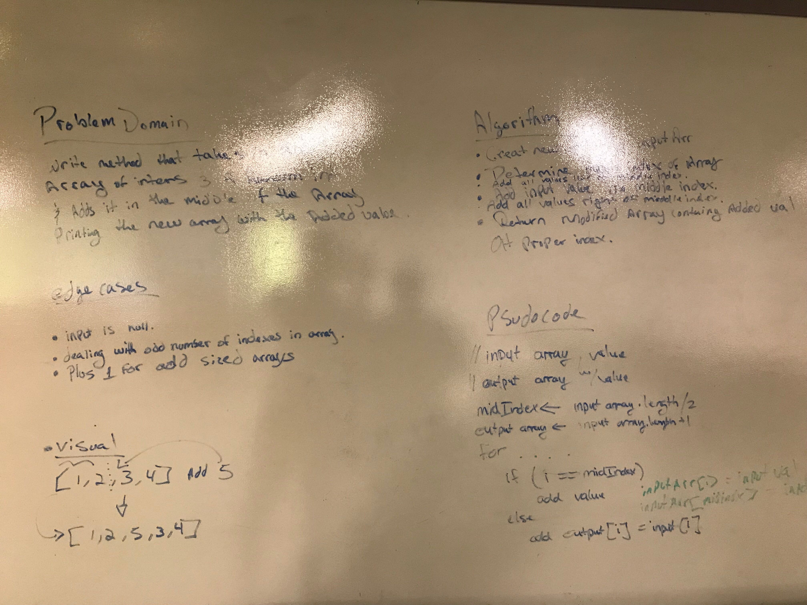

# data-structures-and-algorithms

## 401 Code Challenges

### Week 1
* [Array Reverse](.otherReadmes/arrayReverse.md)

----

## Insert Shift Array
Code Challenge: Class 02

#### Challenge
Write a function called insertShiftArray which takes in an array and the value to be added. Without utilizing any of the built-in methods available to your language, return an array with the new value added at the middle index.

#### Approach & Efficiency
I created a new int[] that was 1 length greater than input[], determined the middle index and performed 3 steps to add the appropriate values into the new int[]: 1) loop through input[] up to middle index and insert it's values into new int[]. 2) add new int input value into new int[] at middle index. 3) loop through input[] after middle index and and insert it's values into new int[]. 

#### Solution

